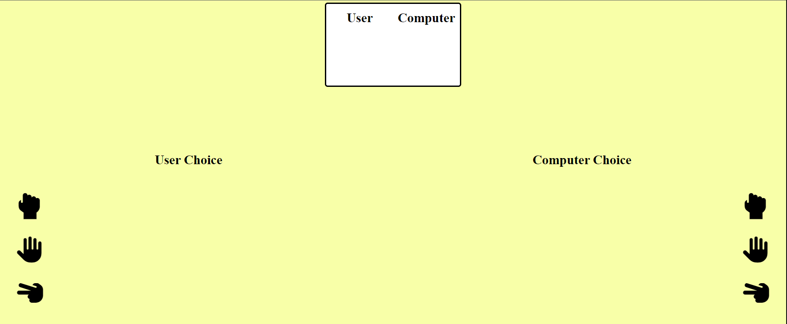
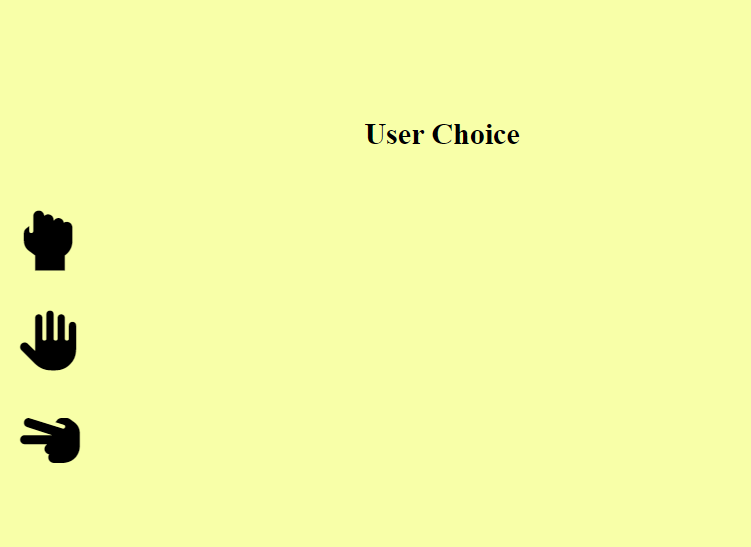
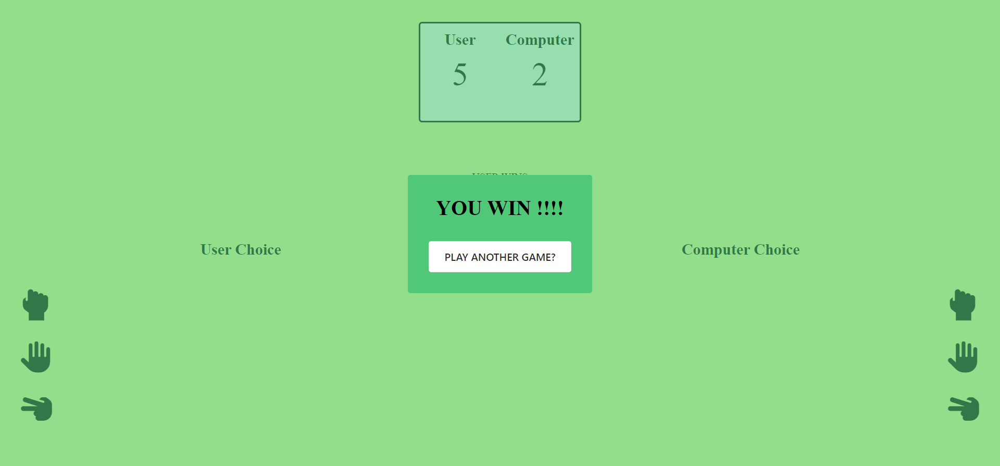
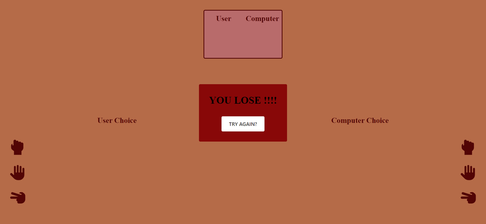

# Rock Paper Scissors

This is first project using vanilla js within [The Odin Project](https://www.theodinproject.com/) course.

## Demo-Preview

Try the application from [here](https://yousef8.github.io/rock-paper-scissors/) :point_left:

## Installation

No need for any installation just double click the [index.html](./index.html) file.

## Usage

- Once you open the site the game will be waiting for you to choose one of the three icons representing (ROCK, PAPER, SCISSOR) in the user area. Like in following image :
  

- Once you do that the computer will make his move and a phrase will come up showing the result of this round and the score board will be updated.

- The first player who gets 5 points the game will end and if you win you will get screen look like this image

  

  and if you lose you will get this page

  

## Future Features

:white_check_mark: | Kickass UI

⬜️ | registration

⬜️ | login

:white_large_square: | player vs. player

:white_large_square: | realtime online playing
